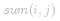
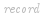
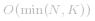
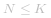
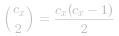
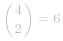
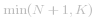

### 📺 视频题解  
 [...74. 和可被 K 整除的子数组.mp4](d64ddf7b-c646-4a0a-955f-b3d2b9cc236c)

### 📖 文字题解

本题与题目 560 非常相似，可以从相同的角度思考解法。而由于本题提高了数据量的要求，暴力法在本题不能通过，因此这里不再给出。

#### 方法一：哈希表 + 逐一统计

**思路和算法**

通常，涉及连续子数组问题的时候，我们使用前缀和来解决。

我们令 *P[i] = A[0] + A[1] + ... + A[i]*。那么每个连续子数组的和   就可以写成 *P[j] - P[i-1]*（其中 *0 < i < j*）的形式。此时，判断子数组的和能否被 *K* 整除就等价于判断 ![(P\[j\]-P\[i-1\])\bmodK==0 ](./p___P_j__-_P_i-1___bmod_K_==_0_.png) ，根据 [同余定理](https://baike.baidu.com/item/%E5%90%8C%E4%BD%99%E5%AE%9A%E7%90%86/1212360?fr=aladdin)，只要 ![P\[j\]\bmodK==P\[i-1\]\bmodK ](./p__P_j__bmod_K_==_P_i-1__bmod_K_.png) ，就可以保证上面的等式成立。

因此我们可以考虑对数组进行遍历，在遍历同时统计答案。当我们遍历到第 *i* 个元素时，我们统计以 *i* 结尾的符合条件的子数组个数。我们可以维护一个以前缀和模 *K* 的值为键，出现次数为值的哈希表  ，在遍历的同时进行更新。这样在计算以 *i* 结尾的符合条件的子数组个数时，根据上面的分析，答案即为 *[0..i-1]* 中前缀和模 *K* 也为 ![P\[i\]\bmodK ](./p__P_i__bmod_K_.png)  的位置个数，即 ![\textit{record}\[P\[i\]\bmodK\] ](./p__textit{record}_P_i__bmod_K__.png) 。

最后的答案即为以每一个位置为数尾的符合条件的子数组个数之和。需要注意的一个边界条件是，我们需要对哈希表初始化，记录 ![\textit{record}\[0\]=1 ](./p__textit{record}_0__=_1_.png) ，这样就考虑了前缀和本身被 *K* 整除的情况。

注意：不同的语言负数取模的值不一定相同，有的语言为负数，对于这种情况需要特殊处理。

```C++ [sol1-C++]
class Solution {
public:
    int subarraysDivByK(vector<int>& A, int K) {
        unordered_map<int, int> record = {{0, 1}};
        int sum = 0, ans = 0;
        for (int elem: A) {
            sum += elem;
            // 注意 C++ 取模的特殊性，当被除数为负数时取模结果为负数，需要纠正
            int modulus = (sum % K + K) % K;
            if (record.count(modulus)) {
                ans += record[modulus];
            }
            ++record[modulus];
        }
        return ans;
    }
};
```

```Java [sol1-Java]
class Solution {
    public int subarraysDivByK(int[] A, int K) {
        Map<Integer, Integer> record = new HashMap<>();
        record.put(0, 1);
        int sum = 0, ans = 0;
        for (int elem: A) {
            sum += elem;
            // 注意 Java 取模的特殊性，当被除数为负数时取模结果为负数，需要纠正
            int modulus = (sum % K + K) % K;
            int same = record.getOrDefault(modulus, 0);
            ans += same;
            record.put(modulus, same + 1);
        }
        return ans;
    }
}
```

```Python [sol1-Python3]
class Solution:
    def subarraysDivByK(self, A: List[int], K: int) -> int:
        record = {0: 1}
        total, ans = 0, 0
        for elem in A:
            total += elem
            modulus = total % K
            same = record.get(modulus, 0)
            ans += same
            record[modulus] = same + 1
        return ans
```

```golang [sol1-Golang]
func subarraysDivByK(A []int, K int) int {
    record := map[int]int{0: 1}
    sum, ans := 0, 0
    for _, elem := range A {
        sum += elem
        modulus := (sum % K + K) % K
        ans += record[modulus]
        record[modulus]++
    } 
    return ans
}
```

**复杂度分析**

- 时间复杂度：*O(N)*，其中 *N* 是数组 *A* 的长度。我们只需要从前往后遍历一次数组，在遍历数组的过程中，维护哈希表的各个操作均为 *O(1)*，因此总时间复杂度为 *O(N)*。

- 空间复杂度： ，即哈希表需要的空间。当   时，最多有 *N* 个前缀和，因此哈希表中最多有 *N+1* 个键值对；当 *N > K* 时，最多有 *K* 个不同的余数，因此哈希表中最多有 *K* 个键值对。也就是说，哈希表需要的空间取决于 *N* 和 *K* 中的较小值。

#### 方法二：哈希表 + 单次统计

**说明**

此方法延续上面前缀和 + 哈希表的思路，只是不再采用边遍历边计算答案的方法，而是从排列组合的角度考虑如何统计答案，希望能给读者一些多角度的启发。

**思路和算法**

考虑方法一中的思路，我们可以在遍历只维护哈希表。在遍历结束后，我们再遍历哈希表，用排列组合的方法来统计答案。

对于哈希表中的每个键值对 *(x, c_x)*，它表示前缀和 *x*（在模 *K* 的意义下）出现了 *c_x* 次。那么这些出现的位置两两之间都可以构成可被 *K* 整除的连续子数组，数量即为   个可被 *K* 整除的连续子数组。例如当 *c_x = 5* 时，那么两两组合共有   个子数组。

举一个具体的例子，给定数组为 *A = [4,5,0,-2,-3,1]* 以及 *K = 5*，那么前缀和 *P = [4,9,9,7,4,5]*，对 *K* 取模即为 *[4,4,4,2,4,0]*，那么可以哈希表中包含的键值对为 *(0, 2), (2, 1), (4, 4)*：以 *(4, 4)* 为例：

- 对于 *c_4 = 4*，对应的前缀和为 *P[0], P[1], P[2], P[4]*，那么一共有   个和能被 *K* 整除的连续子数组，分别是 *A[1:1], A[1:2], A[1:4], A[2:2], A[2:4], A[4:4]*，其中 *A[i:j]* 表示下标从 *i* 到 *j* 的子数组。

```C++ [sol2-C++]
class Solution {
public:
    int subarraysDivByK(vector<int>& A, int K) {
        unordered_map<int, int> record = {{0, 1}};
        int sum = 0;
        for (int elem: A) {
            sum += elem;
            // 注意 C++ 取模的特殊性，当被除数为负数时取模结果为负数，需要纠正
            int modulus = (sum % K + K) % K;
            ++record[modulus];
        }

        int ans = 0;
        for (auto [x, cx]: record) {
            ans += cx * (cx - 1) / 2;
        }
        return ans;
    }
};
```

```Java [sol2-Java]
class Solution {
    public int subarraysDivByK(int[] A, int K) {
        Map<Integer, Integer> record = new HashMap<>();
        record.put(0, 1);
        int sum = 0;
        for (int elem: A) {
            sum += elem;
            // 注意 Java 取模的特殊性，当被除数为负数时取模结果为负数，需要纠正
            int modulus = (sum % K + K) % K;
            record.put(modulus, record.getOrDefault(modulus, 0) + 1);
        }

        int ans = 0;
        for (Map.Entry<Integer, Integer> entry: record.entrySet()) {
            ans += entry.getValue() * (entry.getValue() - 1) / 2;
        }
        return ans;
    }
}
```

```Python [sol2-Python]
class Solution:
    def subarraysDivByK(self, A: List[int], K: int) -> int:
        record = {0: 1}
        total = 0
        for elem in A:
            total += elem
            modulus = total % K
            record[modulus] = record.get(modulus, 0) + 1
        
        ans = 0
        for x, cx in record.items():
            ans += cx * (cx - 1) // 2
        return ans
```

```golang [sol2-Golang]
func subarraysDivByK(A []int, K int) int {
    record := map[int]int{0: 1}
    sum, ans := 0, 0
    for _, elem := range A {
        sum += elem
        modulus := (sum % K + K) % K
        record[modulus]++
    }
    for _, cx := range record {
        ans += cx * (cx - 1) / 2
    }
    return ans
}
```

**复杂度分析**

- 时间复杂度：*O(N)*，其中 *N* 是数组 *A* 的长度。我们首先从前往后遍历一次数组，时间复杂度为 *O(N)*。随后我们遍历哈希表并求出答案，由于哈希表中最多只有   个键值对，因此遍历的时间复杂度不会超过 *O(N)*，总时间复杂度为 *O(N)*。

- 空间复杂度： ，即哈希表需要的空间。